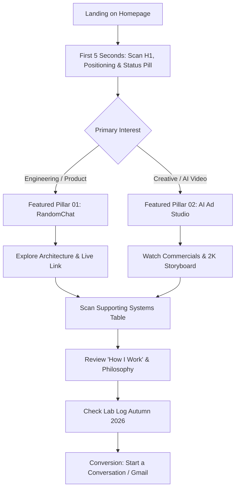

# Portfolio Website Overview

**Document Purpose:** Master source of truth and architectural overview of Kanishk Roy's personal portfolio website (`https://portfolio-kohl-eta-20.vercel.app/`). This document is written for future AI models and developers to understand the site's complete design system, codebase implementation, content strategy, user journeys, technical trade-offs, and future evolution roadmap without requiring previous conversation context.

---

## 1. Executive Summary

Kanishk Roy's portfolio is a high-craft static website built with **Astro 5.4.0**, **Tailwind CSS v4** (via `@tailwindcss/vite`), and **TypeScript 5.7.3**, deployed on **Vercel** with static site generation (SSG). 

The website deliberately rejects the tropes of generic junior developer portfolios, SaaS sales pages, and flashy "AI agency" templates. Instead, it embodies an **Editorial Product Studio × Technical Lab** aesthetic:
- **Two Flagship Pillars:** A real-time edge product (**RandomChat**) and a disciplined commercial video framework (**AI Ad Production Studio** with real YouTube embeds for Adidas Samba and Kreo Tech).
- **Three Supporting Applied Systems:** An autonomous intelligence engine (**AI Research Analyst**), an e-commerce growth tear-down (**Wellbeing Nutrition CRO**), and a client-side WASM document utility (**CleanPDF**).
- **Design Ethos:** Precision typography (Geist and Geist Mono), tactile background textures, hairline borders, an anti-FOUC 3-mode theme system (Auto/Light/Dark), and zero fabricated metrics or buzzwords.
- **Current State:** 10 statically compiled routes (`/`, `/work`, 5 case study pages, `/about`, `/contact`, `/404`), 0 TypeScript errors, 0 Astro check warnings, fully functional interactive widgets (theme switching, hero visual toggle, commercial player switcher).

The website establishes Kanishk not as an academic computer scientist or theoretical researcher, but as an **ambitious, multidisciplinary product builder and creative technologist** who bridges systems thinking, prompt architecture, UI/UX craft, and business pragmatism.

---

## 2. Portfolio Purpose

### Primary Objective
The website serves as a living proof archive that demonstrates how Kanishk takes ambiguous, messy ideas and converts them into production-ready digital products, generative media campaigns, and utility systems.

### Core Underlying Message
> *"I build, experiment, learn, and solve real problems using business thinking, product thinking, design, and AI."*

### What the Portfolio Achieves
1. **Employment & High-Impact Roles:** Positions Kanishk for Associate Product Manager (APM), Product Engineer, AI Technologist, Creative Technologist, and Product Design roles.
2. **High-Value Freelancing & Consulting:** Serves as client-facing evidence for edge application development, conversion rate optimization (CRO), and AI-driven commercial video production.
3. **Founder & Co-founder Credibility:** Demonstrates end-to-end execution capability—proving he can design, code, test, deploy, and market digital products independently.
4. **Network & Personal Branding:** Establishes a serious, mature identity in public, distinct from template-driven student portfolios.

---

## 3. Target Audience

The site is engineered for four distinct visitor personas, each looking for specific signals within a 10-to-30 second scan:

| Persona | Motivation & Scrutiny | Required Signal on Site | What Turns Them Away |
|---|---|---|---|
| **Tech Startup Founders & Co-Founders** | Seeking resourceful builders who can own a product from zero to one without constant hand-holding. | Evidence of shipping end-to-end (architecture diagrams, repo links, live production links). | Theoretical slide decks, textbook tutorial projects (e.g., standard to-do apps, clone sites). |
| **Product & Engineering Hiring Managers** | Evaluating technical rigor, system architecture choices, code cleanliness, and pragmatic decision-making. | Clear engineering rationale (e.g., choosing Cloudflare Durable Objects over Redis for ephemeral state). | Buzzword-heavy copy, unbacked claims like "10x engineer" or "expert in all AI". |
| **Brand Directors & Creative Agency Leads** | Looking for creative engineering, narrative pacing, commercial video quality, and aesthetic discernment. | Commercial video reels (Adidas, Kreo), 2K storyboards, foley sound design breakdowns, editorial typography. | Typical AI video hallucinations, morphing artifacts, lack of art direction. |
| **D2C Founders & Growth Operators** | Seeking conversion gains, checkout friction reduction, and analytical UX improvements. | Diagnostic funnel breakdown (Wellbeing Nutrition case study), structured claim taxonomies, user empathy. | Surface-level visual redesigns that ignore business metrics and unit economics. |

---

## 4. Personal Positioning

### Explicit Positioning Guardrails
- **Who Kanishk Is:** A multidisciplinary builder operating at the convergence of product thinking, systems engineering, artificial intelligence, and creative direction.
- **Who Kanishk Is NOT (Explicitly Banned Positions):**
  - Not an academic AI researcher or deep learning scientist.
  - Not an enterprise cloud infrastructure architect.
  - Not a self-proclaimed "Growth Guru", "10x Developer", or "Serial Entrepreneur".
  - Not a generic junior developer listing 30 unverified programming languages.

### Core Narrative Spines
- **Tagline:** *"Product thinking × AI × hands-on execution."*
- **Operating Formula:** `DECONSTRUCT → BUILD → TEST → REFINE`
- **Execution Ethos:** `IDEAS → SYSTEMS → REAL THINGS`
- **Rule of Authenticity:** Zero fake metrics. No fabricated user numbers, no invented MRR, no unsubstantiated benchmark claims. Every claim traces to an inspectable artifact (live domain, GitHub commit, video master, or architectural schematic).

---

## 5. Current Website Structure

The current codebase contains 10 static HTML page routes:

```
src/pages/
├── index.astro                     # Route: / (Homepage overview)
├── about.astro                     # Route: /about (Biography, philosophy, toolkit)
├── contact.astro                   # Route: /contact (Direct communication channels)
├── 404.astro                       # Route: /404 -> dist/404.html (Not Found page)
└── work/
    ├── index.astro                 # Route: /work (Complete systems archive)
    ├── randomchat.astro            # Route: /work/randomchat (Pillar 01 Case Study)
    ├── ai-ad-production.astro      # Route: /work/ai-ad-production (Pillar 02 Case Study)
    ├── ai-research-analyst.astro   # Route: /work/ai-research-analyst (Supporting 03)
    ├── wellbeing-nutrition.astro   # Route: /work/wellbeing-nutrition (Supporting 04)
    └── cleanpdf.astro              # Route: /work/cleanpdf (Supporting 05)
```

### Homepage Component Composition (`src/pages/index.astro`)
The homepage renders an intentional sequence of 10 structural sections:
1. `Navigation.astro` (Sticky header with monogram, status pill, nav links, and theme toggle)
2. `Hero.astro` (H1 headline, positioning statement, dual CTAs, interactive Figure 01.1 visual toggle, core pillars)
3. `FeaturedRandomChat.astro` (Pillar 01 showcase: UI preview, live badge, technical tags, key decisions)
4. `FeaturedAiAdStudio.astro` (Pillar 02 showcase: Interactive 9:16/16:9 YouTube video player, 13-stage workflow, storyboard link)
5. `Divider.astro` (Editorial graphic divider: Products × AI × Creative Tech)
6. `SupportingWork.astro` (Table/list view of projects 03, 04, 05 with metadata and links)
7. `HowIWork.astro` (6-stage methodology grid: Build, Experiment, AI Systems, Create, Improve, Share)
8. `Divider.astro` (Second editorial divider)
9. `AboutSection.astro` (Dark contrast section featuring quote SVG, 3 disciplines, and tool tags)
10. `CurrentlySection.astro` (Autumn 2026 Lab Log with active testing, production, and research status cards)
11. `ContactSection.astro` (H2 collaboration callout, primary Gmail CTA, channel links)
12. `Footer.astro` (Dark footer with coordinates, social links, copyright, and motto)

---

## 6. Section-by-Section Analysis

### 6.1 Top Navigation (`src/components/Navigation.astro`)
- **Purpose:** Persistent orientation, brand identification, live availability status, and theme switching.
- **Content:** Geometric SVG `KR` monogram, `Studio` badge, desktop status indicator (`● Available for Q4 Product & AI Systems`), internal links (`Work`, `About`, `Contact`), 3-button theme switcher (`Auto`, `Light`, `Dark`), and desktop CTA (`Let's Talk →`).
- **Layout & Visual Hierarchy:** `sticky top-0 z-40`, backdrop blur (`backdrop-blur-md`), 72px height (`h-18`). Clear horizontal alignment with brand left, status center (desktop), and utilities right.
- **User Interaction:** Active page indicator with electric blue underline (`h-[1.5px]`), theme switching clicks with instant document attribute update.
- **Animation:** Continuous pinging pulse on status indicator (`animate-ping`).
- **CTA:** `Let's Talk →` pointing to `/contact`.
- **Responsive Behavior:** 
  - `< 640px` (mobile): Hides status pill, hides "Studio" text, hides "Let's Talk" button, compacts theme switcher to icon-only buttons.
  - Links (`Work`, `About`, `Contact`) stay inline. There is **no mobile hamburger drawer**.
- **What Works:** Extremely clean, zero clutter, persistent availability indicator provides real agency feel.
- **What Appears Weak:** On 375px mobile screens, the logo, 3 nav links, and 3-button theme switcher compete for tight horizontal width. No mobile drawer menu exists.
- **Future Improvement:** Add a dedicated mobile sheet or drawer if additional navigation routes (e.g., Blog, Experiments, Lab Notes) are introduced.

### 6.2 Hero Section (`src/components/Hero.astro`)
- **Purpose:** Instant first-impression communication of identity, positioning, geographic origin, and proof-driven attitude.
- **Content:**
  - Coordinates & Eyebrow: `KANISHK ROY / PRODUCT STUDIO × TECH LAB` | `22°34'N 88°22'E • KOLKATA, IN`
  - H1 Headline: *"I build digital products & AI-powered systems."*
  - Subtitle: *"Product thinking × AI × hands-on execution."*
  - Body: *"I take messy ideas, break them down, and turn them into working products, edge systems, and creative experiences. Evidence over decoration. Real work over generic claims."*
  - CTAs: `Explore Work ↓`, `Let's Talk ↗`, inline Gmail address.
  - Figure 01.1 Visual Container: Technical crop marks, 4:3 aspect ratio image container, caption bar, and interactive `[ Switch Mode ]` button toggling between Workspace A (`hero-editorial.jpg`) and Architecture B (`hero-architecture.jpg`).
  - Core Pillars Ribbon: `01 REAL-TIME SYSTEMS` • `02 GENERATIVE AI PRODUCTION` • `03 EVIDENCE-BACKED RESEARCH` | `ZERO FAKE METRICS • EVIDENCE-FIRST`.
- **Layout:** 12-column grid (`col-span-7` copy, `col-span-5` visual).
- **User Interaction:** Clicking `[ Switch Mode ]` swaps image source and alters button label dynamically via vanilla TypeScript.
- **Responsive Behavior:** Stacks vertically on mobile/tablet (`lg:grid-cols-12`). Copy moves above visual.
- **What Works:** Avoids generic personal intro ("Hi, I am Kanishk"). The technical registration marks and coordinates frame the site as a serious engineering lab.
- **What Appears Weak:** The hero image toggle (`Workspace A` vs `Architecture B`) is a clever developer toy, but visitors rarely know what "Switch Mode" is for. The images themselves are heavy JPEGs (866KB and 762KB).
- **Future Improvement:** Optimize images to modern AVIF/WebP under 120KB. Turn the hero visual into an interactive interactive project preview or high-fidelity technical canvas.

### 6.3 Pillar 01: RandomChat (`src/components/FeaturedRandomChat.astro`)
- **Purpose:** Prove high-concurrency real-time engineering and product capability on Cloudflare edge.
- **Content:** Eyebrow `01 // FEATURED SYSTEM / TECHNICAL PILLAR`, green status badge `LIVE EDGE SYSTEM`, screenshot of production dark UI, architecture preview drawer (`CF WORKERS → DURABLE OBJECTS → WEBSOCKETS`), description, 6 technology pills, 3 core engineering decisions, link to case study.
- **Layout:** 12-column asymmetrical split (`col-span-7` interactive card, `col-span-5` narrative).
- **User Interaction:** Entire image card links to `/work/randomchat`. Hover triggers image zoom (`group-hover:scale-[1.02]`) and border color transition to accent blue.
- **Responsive Behavior:** Flips order on mobile (`order-1` copy, `order-2` visual) so the user reads the problem before seeing the screen.
- **What Works:** Clearly establishes real-world full-stack competence. Highlighting specific architectural trade-offs (Durable Objects vs Redis) instantly signals real experience.
- **What Appears Weak:** The live link to the external app (`https://randomcaht.online`) is tucked inside the case study rather than directly accessible from the homepage preview card.
- **Future Improvement:** Add a secondary mini-pill linking directly to the live deployment alongside the case study link.

### 6.4 Pillar 02: AI Ad Production Studio (`src/components/FeaturedAiAdStudio.astro`)
- **Purpose:** Prove creative direction, prompt engineering discipline, and commercial video post-production capability.
- **Content:** Eyebrow `02 // FEATURED CREATIVE SYSTEM / AI PRODUCTION PILLAR`, title, value proposition, format switcher tabs (`01 / ADIDAS SAMBA (9:16)` vs `02 / KREO TECH (16:9)`), 13-stage pipeline visual card, 3 campaign proof points, and an embedded YouTube video player with simulated terminal frame header.
- **Layout:** Inverted 12-column split (`col-span-5` narrative left, `col-span-7` video player right) creating alternating visual cadence with Section 6.3.
- **User Interaction:** Tab switcher swaps the YouTube video iframe source, changes the aspect ratio wrapper (`aspect-[9/16]` for vertical mobile reel vs `aspect-video` for 16:9 widescreen), and toggles active button states.
- **Responsive Behavior:** Player dynamically resizes. Stacks cleanly on smaller viewports.
- **What Works:** Embedding actual playable commercials directly on the homepage provides undeniable proof of quality that static mockups cannot achieve. The format toggle handles vertical and horizontal videos seamlessly.
- **What Appears Weak:** Loading YouTube iframes introduces third-party tracking scripts and layout recalculations on mobile devices.
- **Future Improvement:** Implement a lightweight custom video player using native HTML5 `<video>` with poster frames and lazy playback initialization, avoiding YouTube embed bloat.

### 6.5 Supporting Work Archive (`src/components/SupportingWork.astro`)
- **Purpose:** Demonstrate breadth across intelligence systems, growth research, and client-side utilities without overwhelming the homepage.
- **Content:** Projects 03 (AI Research Analyst), 04 (Wellbeing Nutrition CRO), and 05 (CleanPDF) presented in a clean tabular row format. Each row has index number, category tag, title, 2-line summary, year, and hover arrow.
- **Layout:** Full-width divided list (`divide-y`). Desktop splits each row into 3 columns (`col-span-3`, `col-span-6`, `col-span-3`).
- **User Interaction:** Entire row is a clickable link to the respective case study with hover background highlight (`hover:bg-white/70 dark:hover:bg-[#181818]/70`).
- **Responsive Behavior:** Stacks into a clean card-like vertical layout on mobile.
- **What Works:** Maintains tight editorial hierarchy. Prevents the homepage from becoming an endless grid of identical cards.
- **What Appears Weak:** Visual previews are omitted in this table view; visitors only see text until clicking through.
- **Future Improvement:** Add an optional subtle floating image thumbnail that appears on row hover (desktop) for visual intrigue.

### 6.6 How I Work (`src/components/HowIWork.astro`)
- **Purpose:** Demystify Kanishk's operational philosophy and problem-solving methodology.
- **Content:** Eyebrow `04 // OPERATIONAL PHILOSOPHY`, H2 *"How I Work"*, descriptive paragraph, 6-card grid with custom SVGs (`BUILD`, `EXPERIMENT`, `AI SYSTEMS`, `CREATE`, `IMPROVE`, `SHARE`), bottom formula ribbon: `DECONSTRUCT → BUILD → TEST → REFINE` | `NO SAAS TEMPLATES • HANDMADE CRAFT`.
- **Layout:** Responsive 3-column grid (`grid-cols-1 md:grid-cols-2 lg:grid-cols-3`) with background dot-grid texture (`radial-gradient`).
- **User Interaction:** Hover shifts border color to accent blue with subtle shadow.
- **Responsive Behavior:** 1 column on mobile, 2 on tablet, 3 on desktop.
- **What Works:** Uses concrete action verbs rather than vague adjectives ("Fast learner", "Hard worker").
- **What Appears Weak:** 6 steps can feel slightly abstract compared to the intense specificity of the project case studies.
- **Future Improvement:** Tie each of the 6 steps directly to one concrete artifact from the portfolio (e.g., "Build" references RandomChat sockets; "Create" references the 2K Adidas storyboard).

### 6.7 About & Philosophy (`src/components/AboutSection.astro`)
- **Purpose:** Humanize the builder, articulate personal vision, and list technical competencies.
- **Content:** Dark container (`bg-[#0C0C0D]`), SVG quotation banner (*"Same Curiosity. Different Forms."*), biography copy, 3 discipline breakdowns (Digital Products, AI Systems, Creative Direction), and a pill cloud of 14 core tools (TypeScript, Python, FastAPI, React 19, Astro, Cloudflare, etc.).
- **Layout:** Deep midnight container spanning the full viewport width, creating a visual pause between light sections.
- **User Interaction:** Link to `/about`.
- **Responsive Behavior:** Stacks into a single column.
- **What Works:** The dark section break creates a premium, cinematic pacing change. The copy emphasizes full-stack ownership.
- **What Appears Weak:** The tool pills are static and unlinked.
- **Future Improvement:** Allow clicking a tool to filter or highlight which projects in the archive utilized that specific tool.

### 6.8 Currently Section (`src/components/CurrentlySection.astro`)
- **Purpose:** Demonstrate active momentum, intellectual curiosity, and continuous building in real time.
- **Content:** Header with pulsing green dot (`LAB LOG // AUTUMN 2026`), 3 status cards:
  1. *Edge Real-Time Systems* (State: Active Testing)
  2. *AI Ad Production Pipelines* (State: Production)
  3. *Verifier Gates & Grounding* (State: Research)
- **Layout:** 3-column grid.
- **User Interaction:** Static informational cards.
- **Responsive Behavior:** Stacks to single column on mobile.
- **What Works:** Signals that the portfolio is not an abandoned student project from two years ago, but an active, running laboratory.
- **What Appears Weak:** Static text without direct links to work-in-progress repos, notes, or changelogs.
- **Future Improvement:** Link each card to a lightweight "Lab Note" or public commit/branch.

### 6.9 Contact & Collaboration (`src/components/ContactSection.astro`)
- **Purpose:** Drive conversions, initiate client briefs, and facilitate direct recruiting inquiries.
- **Content:** Eyebrow `07 // CONTACT & COLLABORATION`, H2 *"Let's build something real together"*, subline, primary CTA button (`START A CONVERSATION →`), secondary mail app button, and a 4-channel verified links grid (Gmail, LinkedIn, GitHub, X).
- **Layout:** Left-aligned editorial container with subtle blue ambient background radial glow.
- **User Interaction:** Primary button opens direct Gmail web compose in a new tab (`mail.google.com/mail/?view=cm&fs=1&to=kanishkroy2004@gmail.com`), secondary button uses native `mailto:`. Social links open in new tabs.
- **Responsive Behavior:** Stacks into 2 columns on tablet, 1 column on mobile.
- **What Works:** Having a direct Gmail web compose button is a proven conversion pattern for desktop users who dislike native mail client popups.
- **What Appears Weak:** No embedded contact form for users who want to submit a quick project inquiry without opening an email client.
- **Future Improvement:** Add an optional minimalist, privacy-first inquiry form (e.g., using Formspree or Cloudflare Workers) alongside direct email.

### 6.10 Site Footer (`src/components/Footer.astro`)
- **Purpose:** Final branding, global coordinates, legal copyright, and secondary social links.
- **Content:** KR wordmark with accent dot, Kolkata coordinates (`22°34'N 88°22'E`), social links, copyright year (2026), and studio motto (`IDEAS → SYSTEMS → REAL THINGS`).
- **Layout:** 12-column grid in dark container (`bg-[#0C0C0D]`) with background contour overlay texture.
- **Responsive Behavior:** Stacks gracefully on mobile viewports.
- **What Works:** Extremely understated and consistent with the dark section aesthetic.

---

## 7. Visual Design System

### 7.1 Color Architecture (`src/styles/tokens.css`)

The color system is explicitly partitioned between Light and Dark themes, avoiding pure black (`#000000`) or harsh clinical white (`#FFFFFF`) for large surfaces:

```css
/* Light Theme Tokens */
--color-bg: #F7F7F5;               /* Warm architectural off-white */
--color-surface: #FFFFFF;          /* Pure white card backgrounds */
--color-surface-elevated: #EFEFEA; /* Light stone elevated panels */
--color-text-primary: #111111;     /* Near-black deep carbon */
--color-text-muted: #6B6B6B;       /* Neutral medium gray */
--color-text-dim: #999999;         /* Subdued tertiary metadata gray */
--color-border: #DCDCD8;           /* Crisp hairline border */
--color-border-subtle: #E8E8E4;    /* Faint separator line */
--color-accent: #3157FF;           /* Electric international Klein blue */
--color-accent-hover: #2143E0;     /* Deep royal blue hover state */
--color-accent-glow: rgba(49, 87, 255, 0.15);

/* Dark Theme Tokens (Applied when html.dark is present) */
--color-bg: #111111;               /* Deep matte graphite (not OLED black) */
--color-surface: #181818;          /* Elevated card charcoal */
--color-surface-elevated: #202020; /* High-elevation container charcoal */
--color-text-primary: #F5F5F2;     /* Warm chalk off-white */
--color-text-muted: #A3A3A0;       /* Muted technical gray */
--color-text-dim: #777774;         /* Low-contrast annotation gray */
--color-border: #30302D;           /* Dark hairline border */
--color-border-subtle: #242422;    /* Ultra-faint dark divider */
--color-accent: #6B82FF;           /* Softened electric periwinkle-blue */
--color-accent-hover: #8EA0FF;     /* Luminous accent hover */
--color-accent-glow: rgba(107, 130, 255, 0.2);
```

### 7.2 Typography System
- **Sans-serif (Headings & UI):** `Geist`, `Inter`, system fallbacks.
  - Features OpenType feature settings: `cv02`, `cv03`, `cv04`, `cv11`, `ss01` for geometric character perfection.
  - Headings use tight negative letter-spacing (`tracking-[-0.035em]`) and compact leading (`leading-[1.05]`).
- **Monospace (Metadata, Eyebrows, Labels):** `Geist Mono`, `JetBrains Mono`, system monospace.
  - Used for numbers (`01 //`, `2026`), coordinates, tag pills, timestamps, and architectural notations.
  - Set with wide tracking (`tracking-[0.2em]`) and uppercase transformation.

### 7.3 Spacing & Layout Geometry
- **Maximum Container Width:** `max-w-[1320px]` (centered with `mx-auto px-6`).
- **Case Study Container:** `max-w-[1100px]` (media) and `max-w-[900px]` (narrative body).
- **Vertical Rhythm:** Major homepage sections use `py-20 md:py-28`.
- **Card Geometry:** Radii are disciplined—`rounded-xl` (12px) for cards, `rounded-lg` (8px) for inner media, `rounded-md` (6px) for small pills, `rounded-full` for status indicators and primary CTAs.
- **Borders:** Universal 1px hairline borders (`border border-[#DCDCD8] dark:border-[#30302D]`) separating cards and sections.

### 7.4 Textures & Visual Depth
Rather than relying on flat digital colors, the website integrates subtle tactile textures:
1. `texture-paper.svg`: Tiled on the `body` in light mode for subtle print-like tactile grain.
2. `texture-grain-dark.svg`: Tiled on `body` in dark mode and within dark sections.
3. `radial-gradient` dot grid: 24px × 24px micro-grid overlay behind the "How I Work" section.
4. Technical registration marks (`+` crop marks) positioned at container corners.

---

## 8. Content Analysis

### 8.1 Inventory of Stated Claims & Artifacts

| Content Item | Stated Value | Target Audience | Positioning Alignment | Credibility Rating | Rewrite / Adjustment Recommendation |
|---|---|---|---|---|---|
| **Hero Title** | *"I build digital products & AI-powered systems."* | All personas | High; direct and action-oriented. | 10/10 | Retain. It is concise and avoids buzzwords. |
| **Hero Subline** | *"Product thinking × AI × hands-on execution."* | Founders / PMs | High; frames his specific differentiation. | 10/10 | Retain as the primary formula. |
| **Hero Bio** | *"I take messy ideas, break them down, and turn them into working products, edge systems, and creative experiences..."* | All | High; emphasizes problem deconstruction. | 9/10 | Retain. Strong voice. |
| **Studio Status** | *"Available for Q4 Product & AI Systems"* | Clients / Recruiters | High; signals active commercial availability. | 9/10 | Update quarterly to maintain freshness. |
| **Location Data** | `22°34'N 88°22'E • KOLKATA, IN` | Global peers | Adds authentic human grounding. | 10/10 | Retain. Distinctive editorial touch. |
| **Core Formula** | `DECONSTRUCT → BUILD → TEST → REFINE` | Engineering leads | High; demonstrates methodical approach. | 10/10 | Retain. |
| **Education** | *B.Com (Hons) student* (Documented in briefs, omitted from main UI) | Recruiters | Crucial for authenticity. | 8/10 | Keep off the hero, but consider an intentional mention in `/about` framing non-traditional self-taught discipline. |
| **Tool Stack** | 14 tools (TypeScript, Python, FastAPI, Cloudflare, etc.) | Technical recruiters | High; every tool is represented in an actual project. | 10/10 | Retain. Only add tools when new shipped projects require them. |

---

## 9. Project Analysis

The portfolio features 5 distinct projects, organized into two primary pillars and three supporting systems:

### Project 01: RandomChat (Primary Technical Pillar)
- **Problem:** Modern chat applications force user friction (account creation, phone verification, invasive tracking), while legacy anonymous platforms suffer from spam, terrible UX, and centralized server costs.
- **Solution:** A zero-account, anonymous-by-default real-time web platform executing instant matchmaking and ephemeral room pairing on the edge.
- **Architecture:** Cloudflare Workers, Durable Objects (in-memory room state coordination), WebSockets, WebRTC progressive voice request gates.
- **Role:** Full-Stack Engineer & Product Designer.
- **Artifacts & Evidence:**
  - Live production URL: `https://randomcaht.online`
  - GitHub Repository: `https://github.com/kanishkroy-X/onlinechat`
  - System architecture schematic (`randomchat-architecture.svg`)
  - Matching flow progression diagram (`randomchat-matching-flow.svg`)
  - 4 real UI screenshots from dark mode interface
- **Category:** `PRODUCT / REAL-TIME SYSTEM`
- **Impression Strength:** **Tier 1 (Strongest Engineering Proof)**. Shows full-duplex edge architecture, socket lifecycle management, and privacy-first product thinking.

### Project 02: AI Ad Production Studio (Primary Creative Pillar)
- **Problem:** Generative AI video models produce visual novelty but fail at commercial narrative discipline (temporal flicker, anatomical warping, style drift, uncontrolled hallucination).
- **Solution:** A disciplined 13-stage production framework coupling 2K storyboard pre-visualization and prompt token decoupling with traditional timeline assembly, custom LUTs, and authentic Foley sound design.
- **Deliverables:**
  - *Adidas Samba Commercial* (9:16 vertical commercial reel, high-energy streetwear pacing, leather texture retention).
  - *Kreo Tech Commercial* (16:9 widescreen cinematic film exploring macro mechanical hardware).
- **Role:** Creative Director, Prompt Architect & Post-Production Editor.
- **Tools:** Midjourney v6, Runway Gen-3, Kling AI, Premiere Pro, CapCut, Foley Audio.
- **Artifacts & Evidence:**
  - In-page playable YouTube embeds for both commercials.
  - Production pipeline schematic (`pipeline-visual.svg`).
  - Real 2K resolution pre-visualization storyboard grid (`storyboard-samba.jpeg`).
- **Category:** `CREATIVE DIRECTION / AI PRODUCTION`
- **Impression Strength:** **Tier 1 (Strongest Creative Proof)**. Solves the exact complaint brands have with AI video by proving human editorial control and finished commercial polish.

### Project 03: AI Research Analyst (Supporting System)
- **Problem:** LLMs fabricate market sizes, quote non-existent competitor features, and hallucinate citations in executive research.
- **Solution:** A full-stack research intelligence engine that conducts live multi-query web search via Tavily API, grounds claims in verbatim excerpts, and strips hallucinated citations through an automated deterministic Verifier Gate.
- **Role:** Full-Stack AI Engineer.
- **Stack:** Python 3.11, FastAPI, React 19, Tavily API, SQLite, OpenRouter, Pydantic v2.
- **Artifacts & Evidence:**
  - Architecture flow diagram (`architecture.svg`).
  - Documented claim classification taxonomy (Evidence vs Inference vs Analysis vs Assumption).
  - GitHub repository link.
- **Category:** `AI SYSTEMS / MARKET INTELLIGENCE`
- **Impression Strength:** **Tier 2 (High Technical Depth)**. Proves he understands LLM failure modes and knows how to build deterministic software around stochastic models.

### Project 04: Wellbeing Nutrition (Supporting System)
- **Problem:** D2C health and wellness mobile shoppers drop off due to clinical ingredient confusion, hidden recurring subscription terms, and high checkout friction.
- **Solution:** A quantitative CRO tear-down and mobile information architecture redesign: visual benefit matrices, transparent per-day subscription pricing, and sticky 1-tap cart additions.
- **Role:** CRO Strategist & UX Designer.
- **Artifacts & Evidence:**
  - Mobile conversion funnel architecture schematic (`funnel-preview.svg`).
  - Documented A/B test hypothesis roadmap.
- **Category:** `CRO RESEARCH & PRODUCT STRATEGY`
- **Impression Strength:** **Tier 2 (Strong Commercial & Product Thinking)**. Proves he understands unit economics, user psychology, and e-commerce growth funnels.

### Project 05: CleanPDF (Supporting System)
- **Problem:** Uploading sensitive contracts, financial statements, and personal records to cloud PDF converters creates severe privacy leaks.
- **Solution:** A client-side, zero-server document utility that executes compression, merging, and redaction 100% inside browser memory via WebAssembly and Web Workers.
- **Role:** Frontend Engineer & UI Designer.
- **Stack:** WebAssembly, PDF-lib, Web Workers, TypeScript, Vite.
- **Artifacts & Evidence:**
  - Sandboxed WASM architecture schematic (`architecture.svg`).
  - GitHub repository link.
- **Category:** `CLIENT-SIDE UTILITY / PRIVACY`
- **Impression Strength:** **Tier 2 (Clean Utility Engineering)**. Proves client-side performance engineering and off-thread computation capabilities.

---

## 10. User Journey & Experience Walkthrough



### Critical Friction Points in Current Journey
1. **Third-Party Video Player Dependencies:** Loading YouTube embeds inside `FeaturedAiAdStudio` triggers third-party cookie checks, YouTube branded overlays, and slower initial mobile paints.
2. **External Link Visibility:** The live link for RandomChat (`randomcaht.online`) is hidden inside the case study rather than exposed as a prominent button on the homepage preview.
3. **Hero Image Disconnect:** Toggling between "Workspace A" and "Architecture B" does not advance the user's understanding of Kanishk's work.
4. **Navigation Simplicity vs Density:** On mobile, the lack of a dedicated drawer menu means all navigation must remain compressed in the top bar.

---

## 11. Responsive Analysis

The website was audited across seven standard viewport widths:

| Breakpoint | Target Device | Layout Behavior | Issues Identified |
|---|---|---|---|
| **1440px** | Large Desktop / iMac | Max-width container (`1320px`) with generous margins. All 12-col grids expand comfortably. | None. Perfectly balanced whitespace. |
| **1280px** | Standard Laptop / MacBook | Standard container layout. Full nav and status pill visible. | None. |
| **1024px** | iPad Pro / Small Laptop | Status pill remains visible. Grids maintain side-by-side arrangement. | Minor crowding in nav bar between status pill and theme toggle. |
| **768px** | iPad Portrait / Tablet | Status pill hides. Hero grid collapses to vertical stack (copy top, image bottom). | YouTube iframe requires manual touch scroll on some tablet browsers. |
| **430px** | iPhone Pro Max | Single column throughout. Hero visual scales cleanly. | "Let's Talk" button in nav hides. Theme switcher icons scale down. |
| **390px** | iPhone 14 / 15 / 16 | Single column. Supporting work table shifts into vertical card rows. | Tight horizontal clearance in header (logo + 3 nav links + 3 theme buttons). |
| **375px** | iPhone SE / Compact Mobile | Minimum supported viewport width. Responsive clamp scales headings down to ~36px. | No horizontal overflow detected (`overflow-x: hidden`), but top navigation is at its physical density limit. |

---

## 12. Technical Architecture

### 12.1 Core Framework & Tooling
- **Engine:** Astro 5.4.0 (Static Site Generation mode: `output: 'static'`).
- **CSS Framework:** Tailwind CSS 4.0.9 integrated via `@tailwindcss/vite` plugin.
- **Type Checker:** TypeScript 5.7.3 with `@astrojs/check` 0.9.10.
- **Runtime Target:** Pure static HTML/CSS/JS served globally over Vercel Edge CDN.

### 12.2 JavaScript Strategy
- **Minimal Island Footprint:** The website ships virtually zero heavy client runtime frameworks (no React or Vue bundles in the main layout).
- **Vanilla Inline Scripts:**
  1. `BaseLayout.astro`: 15-line anti-FOUC theme detector executing synchronously before DOM paint.
  2. `ThemeToggle.astro`: Clean vanilla JS binding `click` handlers to `.theme-toggle-btn` and updating `localStorage`.
  3. `Hero.astro`: 12-line vanilla script toggling `heroVisual.src`.
  4. `FeaturedAiAdStudio.astro`: Vanilla switcher toggling YouTube embed URLs and wrapper dimensions.
- **Total First-Party JavaScript:** < 4KB gzipped.

### 12.3 Repository Directory Map
```
PORTFOLIO/
├── astro.config.mjs             # Astro config (static output, tailwindcss plugin)
├── package.json                 # Dependencies (Astro 5, Tailwind 4, TypeScript)
├── tsconfig.json                # Strict TypeScript configuration
├── vercel.json                  # Vercel deployment headers & settings
├── public/                      # Static assets directly exposed to web root
│   ├── favicon.svg              # Geometric KR monogram favicon
│   ├── robots.txt               # Crawler directives pointing to sitemap.xml
│   ├── sitemap.xml              # 9 static routes indexed for search engines
│   └── assets/
│       ├── backgrounds/         # Hero images, paper & grain SVG textures, patterns
│       ├── brand/               # Official KR vector brandmarks
│       ├── editorial/           # Quotes, grid accents, section dividers
│       ├── icons/               # 6 operational icons + social SVGs
│       └── projects/            # Project screenshots, diagrams, and video posters
└── src/
    ├── components/              # 13 reusable Astro UI components
    ├── data/                    # Typed data files (projects.ts, siteMetadata.ts)
    ├── layouts/                 # BaseLayout.astro with global metadata
    ├── pages/                   # File-based routing (10 compiled HTML pages)
    └── styles/                  # tokens.css (Design tokens) & global.css (Tailwind)
```

---

## 13. Accessibility (a11y)

### Current Strengths
- **Semantic Hierarchy:** Single `<h1>` per page, followed by logical `<h2>` and `<h3>` nesting.
- **Keyboard Navigation:** Native interactive elements (`<a>`, `<button>`) with dedicated focus rings:
  ```css
  :focus-visible {
    outline: 2px solid var(--color-accent);
    outline-offset: 2px;
  }
  ```
- **Accessible Skip Link:** Screen-reader accessible link at the top of `BaseLayout.astro`:
  ```html
  <a href="#main-content" class="sr-only focus:not-sr-only focus:absolute ...">
    Skip to main content
  </a>
  ```
- **ARIA Radiogroups:** Theme switcher uses `role="radiogroup"` with individual `role="radio"` and `aria-checked` states.
- **Motion Sensitivity:** Explicit `prefers-reduced-motion` block disabling animations for sensitive users:
  ```css
  @media (prefers-reduced-motion: reduce) {
    *, ::before, ::after {
      animation-duration: 0.01ms !important;
      transition-duration: 0.01ms !important;
      scroll-behavior: auto !important;
    }
  }
  ```

### Accessibility Deficits
- **Color Contrast in Subdued Labels:** Low-contrast tokens like `--color-dark-text-dim` (`#666664` on `#111111`) fall below WCAG AA 4.5:1 ratio for small metadata text (10px–11px).
- **YouTube Embed Focus:** External iframes capture tab focus without explicit keyboard escape indicators.

---

## 14. SEO & Social Metadata

### Implementation Audit
- **Canonical URLs:** Dynamically constructed per page using `new URL(Astro.url.pathname, siteMetadata.url)`.
- **Open Graph & Twitter Cards:** Comprehensive tags generated in `BaseLayout.astro`:
  - `og:type = website`
  - `og:image = https://kanishkroy.com/assets/backgrounds/hero-editorial.jpg`
  - `twitter:card = summary_large_image`
- **Sitemap & Robots:** Clean `public/sitemap.xml` listing all 9 public routes, referenced in `public/robots.txt`.
- **Current Canonical Conflict:** The site metadata specifies `https://kanishkroy.com`, but the live deployment is on `https://portfolio-kohl-eta-20.vercel.app`. Search engines indexing the Vercel URL may flag canonical divergence until DNS for `kanishkroy.com` is permanently bound.
- **Structured Data:** **Zero JSON-LD structured data** currently exists. Missing `Person` and `WebSite` schema markup.

---

## 15. Performance Analysis

### Performance Tiers & Issues Identified

#### CRITICAL ISSUES
- **Unoptimized Hero JPEGs:**
  - `hero-editorial.jpg`: **866 KB**
  - `hero-architecture.jpg`: **762 KB**
  - `footer-pattern.jpg`: **610 KB**
  - Totaling over **2.2 MB** of uncompressed raster graphics loaded on the homepage. They should be converted to WebP/AVIF format (< 90 KB each).

#### HIGH PRIORITY
- **Google Fonts Overhead:**
  - `BaseLayout.astro` requests 4 full font families across 18 weights (`Geist:300..800`, `Geist Mono:400..600`, `Inter:300..800`, `JetBrains Mono:400..600`) via a single blocking Google Fonts stylesheet.
  - Solution: Self-host only the 3 essential weights of Geist (`400`, `500`, `700`) and Geist Mono (`400`, `600`) as local `.woff2` files.
- **YouTube Third-Party Iframes:**
  - Two YouTube iframes are initialized inside `FeaturedAiAdStudio.astro` and `ai-ad-production.astro`. Each embed pulls ~500KB of external player scripts.
  - Solution: Use a facade poster pattern that only instantiates the iframe upon user click.

#### MEDIUM PRIORITY
- **Lack of Responsive `srcset`:** Images are loaded at full natural dimensions without responsive source sets for mobile viewports.

#### OPTIONAL IMPROVEMENTS
- Preload critical above-the-fold assets (`hero-editorial.webp`).

---

## 16. Current Strengths

1. **Anti-Slop Aesthetic:** Looks and feels like a serious Scandinavian or Swiss design studio, completely detached from generic AI portfolio templates.
2. **Flagship Projects are Distinct:** Pairing a hardcore distributed edge application (RandomChat) with commercial video campaigns (Adidas Samba) immediately proves rare range.
3. **Evidence-First Case Studies:** The case studies include real architecture diagrams, state flowcharts, and technical decision logs rather than vague summaries.
4. **Instant Theme Switching with Zero FOUC:** Inline blocking script ensures no white flash when refreshing in dark mode.
5. **Clean Codebase Hygiene:** 0 Astro errors, strict TypeScript, modular components, clean separation between data (`projects.ts`) and presentation.

---

## 17. Current Weaknesses

1. **Heavy Assets & Font Bloat:** Over 2.2MB of uncompressed images and 18 Google Font variants drag down Core Web Vitals.
2. **Missing In-Site Playback for Commercials:** Relying on YouTube iframes cheapens the presentation and introduces ads/external player baggage.
3. **No Direct Live Link on Homepage Cards:** Visitors have to click into the RandomChat case study to find the live URL.
4. **Missing Resume / CV Download:** While a full PDF resume is not always needed, recruiters frequently look for a quick 1-page summary.
5. **No Structured Data (JSON-LD):** Lacks search engine entity recognition.
6. **Domain Disconnect:** Metadata references `kanishkroy.com` while live deployment runs on `portfolio-kohl-eta-20.vercel.app`.

---

## 18. Improvement Opportunities

1. **Self-Host Video Assets:** Convert the Adidas Samba and Kreo Tech masters to high-efficiency MP4/WebM files hosted directly on Cloudflare R2 or Vercel Blob with custom video controls.
2. **Interactive Architecture Diagrams:** Convert static SVG architecture diagrams into interactive SVG or canvas widgets where visitors can click on nodes (e.g., Cloudflare Workers, Durable Objects) to see latency benchmarks.
3. **Live Terminal / Interactive Playground:** Add a live interactive widget for CleanPDF or AI Research Analyst directly on the site.
4. **Structured JSON-LD Schema:** Implement `Person`, `CreativeWork`, and `SoftwareApplication` schema.org markup.
5. **Lab Log / Micro-Writing Section:** Expand the "Currently" section into short, dated markdown notes discussing technical experiments.

---

## 19. Future Portfolio Direction

The future iteration of the portfolio should evolve from an **impressive showcase** into an **indispensable technical studio**:
- **Tone:** Minimalist, intelligent, tactile, credible, confident.
- **Visual Personality:** Museum-grade typography, quiet contrast, deep mechanical precision, zero visual noise.
- **Narrative Depth:** Continue doubling down on the dual identity: **Systems Engineering** on the left, **Creative Direction** on the right, linked by **Product Thinking** in the center.
- **Avoidance Checklist:**
  - ❌ Never add floating 3D spheres or Spline animations.
  - ❌ Never add purple/cyan AI glow gradients.
  - ❌ Never add generic animated skill percentage bars.
  - ❌ Never write corporate buzzword bios.

---

## 20. Proposed Future Information Architecture

```
PORTFOLIO (Future Evolution)
├── 01. NAVIGATION (Sticky, Monogram, Status, Work, Studio, Lab, Contact, Theme)
├── 02. HERO (High-Impact Headline, Coordinates, Core Pillars, Verified Proof)
├── 03. FEATURED SYSTEMS (Tabbed or Split Pillar Showcase)
│   ├── System A: RandomChat (Edge Real-Time, WebSocket Sockets, Live Demo Link)
│   └── System B: AI Commercial Studio (Native Video Player, Adidas & Kreo)
├── 04. SELECTED WORK ARCHIVE (Interactive Filterable Matrix: Product, AI, Utility)
│   ├── AI Research Analyst
│   ├── Wellbeing Nutrition CRO
│   └── CleanPDF
├── 05. OPERATIONAL METHODOLOGY ('How I Work' 4-Stage Loop + Real Artifact Links)
├── 06. LAB LOG / NOTES (Short, dated technical write-ups on experiments)
├── 07. BIOGRAPHY & PHILOSOPHY (Dark Section, Motto, Verified Tool Matrix)
├── 08. CONTACT & INQUIRY (Direct Gmail Action, Fast Brief Form, Verified Channels)
└── 09. FOOTER (Coordinates, Copyright, Architecture Statement)
```

---

## 21. Design Principles for Future Work

1. **Evidence Over Decoration:** Every visual element must explain a concept or display real work. If an element exists solely to "fill space", delete it.
2. **Restraint Over Spectacle:** Favor subtle micro-interactions (150ms ease-out transitions, subtle scale transforms) over heavy scroll-jacking or full-screen takeovers.
3. **Tactile Authenticity:** Maintain subtle background grain, hairline borders, and crop marks that evoke high-end architectural notebooks and industrial equipment.
4. **Typography as Interface:** Let large, impeccably kerned typography carry the visual hierarchy. Never crowd headlines with unnecessary background shapes.
5. **Performance as a Feature:** Achieve 100/100 Lighthouse scores. Zero unnecessary client-side JavaScript libraries.

---

## 22. AI Design Brief

**Context for Future AI Models:**
When asked to redesign or implement features for Kanishk Roy's portfolio:
- **Do not introduce Tailwind CSS arbitrary gradients** (`bg-gradient-to-r from-purple-500 to-indigo-500`).
- **Use the token system** defined in `src/styles/tokens.css`.
- **Preserve the editorial tone:** Headlines must sound confident, grounded, and concise. Never generate filler phrases like "Passionate developer eager to make an impact."
- **Honor the two pillars:** RandomChat represents technical engineering depth; AI Ad Production represents creative video excellence. Keep them balanced.
- **Maintain static SSG architecture:** Keep the site compileable via Astro SSG with zero runtime Node.js server dependencies.

---

## 23. Technical Implementation Notes

- **Astro Config:** Static output (`output: 'static'`).
- **Tailwind Setup:** Tailwind v4 uses `@import "tailwindcss";` in `src/styles/global.css`. Custom variants are declared using `@custom-variant dark (&:where(.dark, .dark *));`.
- **Case Study Routing:** Case studies are static `.astro` files in `src/pages/work/` utilizing `CaseStudyLayout.astro`. Data originates in `src/data/projects.ts`.
- **Build Command:** `npm run build` compiles to `dist/` with exactly 10 HTML files.
- **Type Checking:** Run `npx astro check` to verify TypeScript integrity across frontmatter.

---

## 24. Open Questions / Things Requiring Decision

Before initiating future redesigns or major codebase modifications, the following strategic decisions must be finalized:

1. **Custom Domain Binding:** Confirm when `kanishkroy.com` will be mapped to the Vercel deployment so canonical URLs match the live host.
2. **Video Asset Hosting:** Decide whether to move video assets from YouTube embeds to native video files hosted on Cloudflare R2 or Vercel Blob.
3. **Resume / CV Strategy:** Decide whether to add a downloadable 1-page PDF resume or a dedicated `/resume` route.
4. **Interactive Contact Form:** Decide whether to keep contact purely email-based (`mailto:` & Gmail compose) or add a lightweight submission form.
5. **Lab Notes / Micro-Blog:** Decide whether to expand the "Currently" section into a full content collection of engineering write-ups.

---

## Questions for Kanishk

These are the only high-level decisions requiring your input before any redesign or development work begins:

1. **Domain & Hosting:** Are you planning to connect `kanishkroy.com` to this Vercel deployment soon, or should canonical tags temporarily point to the Vercel domain?
2. **Video Hosting Preference:** Would you prefer self-hosting the Adidas Samba and Kreo Tech commercial videos (for instantaneous, zero-ad, native player playback), or keeping them on YouTube for public view count accumulation?
3. **Resume / CV Inclusion:** Do you want a dedicated "Download Resume / CV" button in the navigation or contact section, or do you prefer directing all recruiters to your LinkedIn and portfolio case studies?
4. **Contact Form vs Direct Email:** Are you satisfied with the direct Gmail compose workflow, or would you like a sleek 3-field inquiry form (`Name`, `Email`, `Brief`) embedded directly on `/contact`?
5. **Tone Adjustment:** Does this analysis accurately capture your desired balance between technical systems builder and creative director, or would you like to tilt the emphasis more toward product engineering or more toward creative tech?
